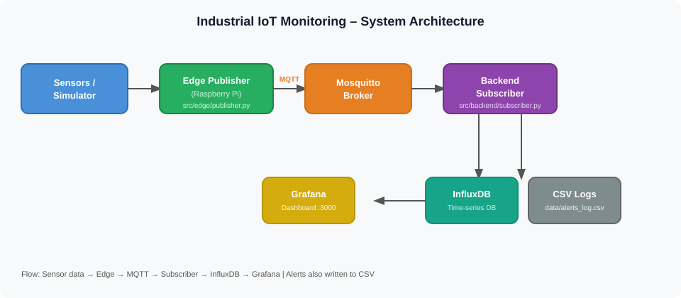
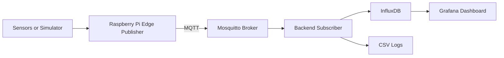
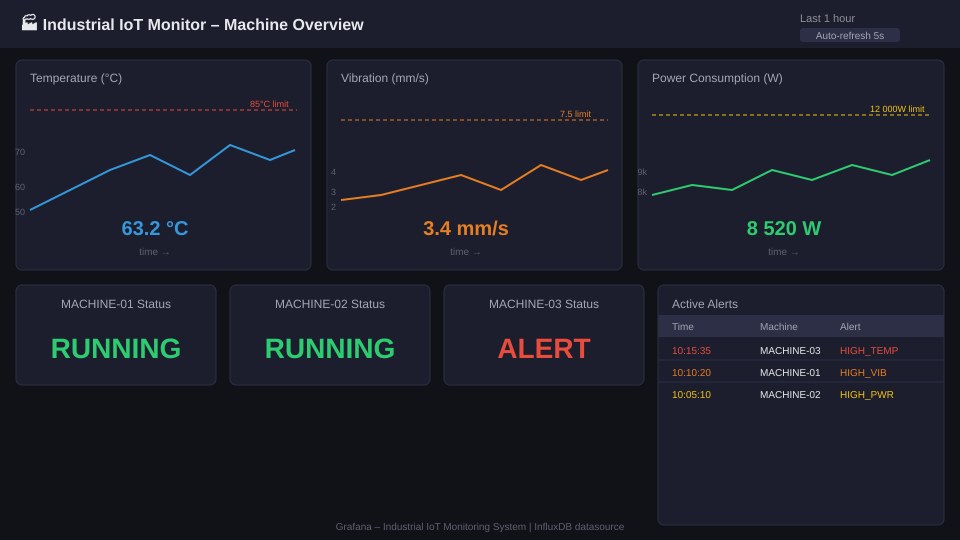
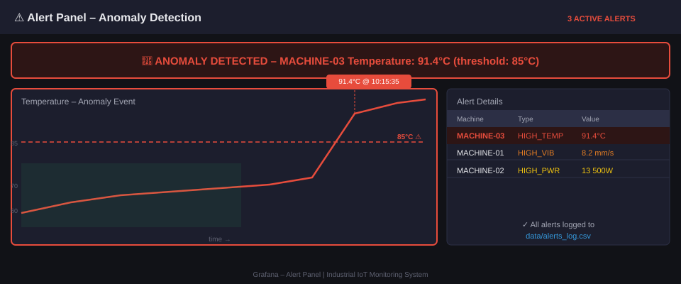
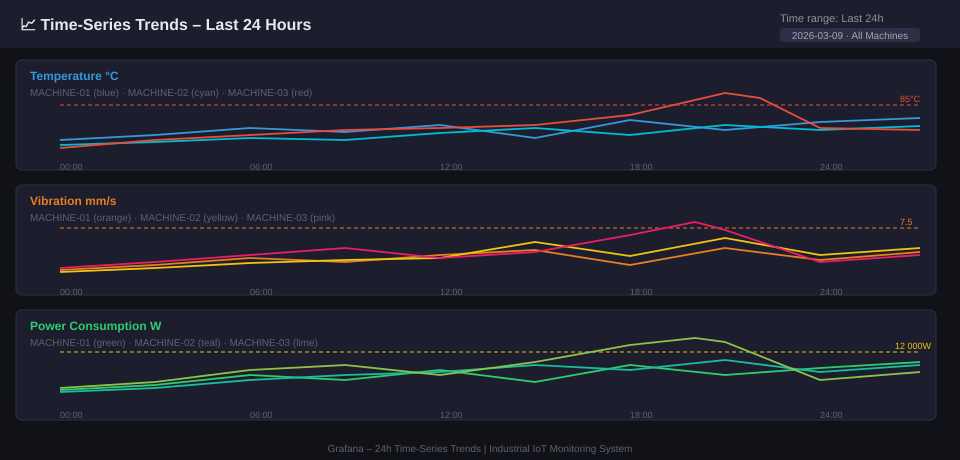

# Industrial IoT Monitoring System

Real-time Industry 4.0 monitoring platform for machine condition tracking using Python, MQTT, Raspberry Pi edge publishing, InfluxDB, and Grafana.

## Problem

Factories often cannot monitor machine conditions in real time. Temperature, vibration, and power anomalies are detected too late, causing unplanned downtime and maintenance costs.

## Solution

This project provides an end-to-end Industrial IoT pipeline:

- Sensor telemetry simulation for machine metrics
- MQTT communication between edge and backend
- Real-time alert detection for abnormal values
- Time-series logging in InfluxDB
- Dashboard visualization in Grafana

The architecture is designed so the simulator can later be replaced by real sensors on a Raspberry Pi.

## Architecture





Detailed description: `docs/architecture.md`.

## Tech Stack

- Python 3.10+
- MQTT (`paho-mqtt`)
- Raspberry Pi (edge runtime target)
- InfluxDB 2.x
- Grafana
- Docker Compose (local infrastructure)

## Features

- Real-time data monitoring
- Alert system for abnormal values
- Data logging (CSV + InfluxDB)
- Machine status dashboard design for Grafana

## Project Status

- [x] MQTT telemetry pipeline (publisher -> broker -> subscriber)
- [x] Alert threshold detection and CSV logging
- [x] InfluxDB integration for time-series storage
- [x] Grafana dashboard specification
- [x] Docker Compose infrastructure (Mosquitto, InfluxDB, Grafana)
- [x] Basic automated tests for core logic
- [x] Dashboard screenshots (optional documentation)

## Project Structure

```text
Industrial-IoT-Monitoring-Projekt/
|-- src/
|   |-- common/
|   |   `-- config.py
|   |-- simulator/
|   |   `-- sensor_simulator.py
|   |-- edge/
|   |   `-- publisher.py
|   `-- backend/
|       `-- subscriber.py
|-- data/
|   `-- .gitkeep
|-- dashboard/
|   `-- grafana_dashboard_description.md
|-- docs/
|   `-- architecture.md
|-- scripts/
|   |-- mosquitto.conf
|   |-- run_publisher.sh
|   `-- run_subscriber.sh
|-- .env.example
|-- docker-compose.yml
|-- requirements.txt
|-- LICENSE
`-- README.md
```

## Telemetry Payload

Published topic:

`factory/machines/<machine_id>/telemetry`

Example MQTT message:

```json
{
	"timestamp": "2026-03-09T10:15:35.123456+00:00",
	"machine_id": "MACHINE-01",
	"temperature_c": 63.2,
	"vibration_mm_s": 3.4,
	"power_w": 8520.5,
	"status": "RUNNING"
}
```

## Quick Start

### 1. Clone and install dependencies

```bash
git clone <your-repo-url>
cd Industrial-IoT-Monitoring-Projekt
python -m venv .venv
source .venv/bin/activate
pip install -r requirements.txt
```

### 2. Configure environment

```bash
cp .env.example .env
```

Update `.env` with your InfluxDB token and organization values.

### 3. Start infrastructure

```bash
docker compose up -d
```

Services:

- MQTT Broker: `localhost:1883`
- InfluxDB: `http://localhost:8086`
- Grafana: `http://localhost:3000`

### 4. Run subscriber (backend)

```bash
chmod +x scripts/run_subscriber.sh scripts/run_publisher.sh
./scripts/run_subscriber.sh
```

### 5. Run publisher (edge simulation)

Open a second terminal:

```bash
./scripts/run_publisher.sh
```

### 6. Run automated tests

```bash
python -m unittest discover -s tests -p "test_*.py"
```

## Alert Logic

Thresholds configurable via `.env`:

- `ALERT_TEMP_MAX` (default: 85 C)
- `ALERT_VIBRATION_MAX` (default: 7.5 mm/s)
- `ALERT_POWER_MAX` (default: 12000 W)

Alert events are logged into `data/alerts_log.csv`.

## Grafana Dashboard

### Login

After starting the infrastructure with `docker compose up -d`, open Grafana in your browser:

**URL:** [http://localhost:3000](http://localhost:3000)

| Field | Value |
|-------|-------|
| Username | `admin` |
| Password | `admin` |

> **Tip:** On first login Grafana may ask you to change the password. You can skip this or set a new one.

After logging in, add InfluxDB as a data source:

1. Go to **Connections → Data sources → Add data source**
2. Choose **InfluxDB**
3. Set **Query Language** to `Flux`
4. Set **URL** to `http://influxdb:8086`
5. Under **InfluxDB Details** set:
   - **Organization:** `iot-org`
   - **Token:** `my-super-secret-token`
   - **Default Bucket:** `iot_metrics`
6. Click **Save & Test**

Dashboard specification is included in:

`dashboard/grafana_dashboard_description.md`

Recommended panels:

- Temperature trend
- Vibration trend
- Power consumption trend
- Machine status
- Active alerts table

## Raspberry Pi Deployment Notes

- Install Python and dependencies on Raspberry Pi.
- Copy project files to edge device.
- Configure MQTT broker IP in `.env`.
- Start `src.edge.publisher` as a systemd service for continuous telemetry.

## Screenshots

### Grafana Overview Dashboard



### Alert Panel During Anomaly



### Time-Series Trends Over 24h



## Future Improvements

- Multiple machine support with device registry
- TLS and authentication for MQTT
- Rule engine for advanced alarms
- Predictive maintenance module (ML)
- REST API for integration with MES/ERP

## License

This project is licensed under the MIT License. See `LICENSE` for details.